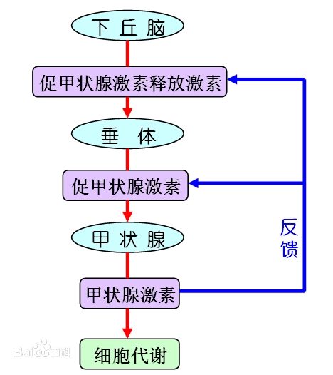

# 反馈调节(Retroalimentacion)
在大脑皮层的影响下，下丘脑可以通过垂体调节和控制某些内分泌腺中激素的合成和分泌；**而激素进入血液后，又可以反过来调节下丘脑和垂体有关激素的合成和分泌**。

## 负反馈(Negativo): 
反射产生的效应**反过来减弱**引起该反射的动因，从而使该反射的活动保持相对稳定。机体内负反馈调节是**非常普遍的**，它可使体内的生理活动具有相对稳定的特性。
## 正反馈(Positivo): 
反射的效应**反过来进一步加强**引起该反射的动因，使反射中枢的活动更为加强。