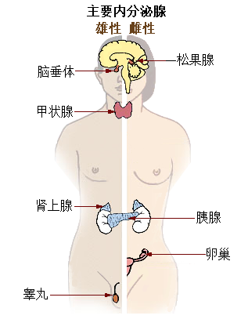

# 腺体

腺体，**为能够合成特殊物质（例如激素）的组织**，且释出至血流中、体腔内或体表；前者（至血流）称内分泌腺，后两者（至体腔、体表）称外分泌腺。

**~(因为这个单元是内分泌系统，所以主要学习内分泌腺)~**

## 内分泌腺
无管腺，直接将产物分泌至周遭细胞外，而后进入血液循环至作用器官发生作用。

- 脑垂腺(Hipofisis)
    - 前叶(Adenohipofisis)
    - 后叶(Neurohipofisis)
- 甲状腺(Tiroide) & 副甲状腺(Paratiroide)
- 胸腺(Timo)
- 肾上腺(Suprrenales)
    - 皮质(Corteza)
    - 髓质(Medulo)
- 胰腺(Pancreo)
- 卵巢(Ovario)
- 睾丸(Testiculos)

## 腺体所分泌的激素
### 脑垂腺
#### 前叶
|                        名称                       |                                 功能                                 |
|:-------------------------------------------------:|:--------------------------------------------------------------------:|
|  甲状腺刺激素 (TSH / Hormona estimulante Tiroide) |                 促使甲状腺分泌甲状腺素及三碘甲状腺素                 |
| 促皮质素 (ACTH / Hormona estimulante suprarrenal) |                   促使肾上腺皮质分泌肾上腺皮质激素                   |
|  生长激素 (GH / Hormona estimulante crecimiento)  |                        促进全身细胞及组织生长                        |
|   滤泡刺激素 (FSH / Hormona folicubesrimulante)   |         在排卵前刺激卵巢中滤泡成长，或促使睾丸中的精子生成。         |
|       黄体成长素 (LH / Hormona luteinizante)      | 对滤泡最后的成长及排卵非常重要；促使卵巢分泌女性素，睾丸分泌男性素。 |
|             泌乳素 (PRL / Prolactina)             |                        促进乳房发育及乳汁分泌                        |

#### 后叶
|              名称             |                        功能                        |
|:-----------------------------:|:--------------------------------------------------:|
| 抗利尿激素(ADH / Vasopresina) | 使肾保留水分，高浓度时能使血管收缩而造成血压上升。 |
|      催产素 (Oxitociria)      |   分娩时促进子宫收缩；促使乳腺的肌皮膜细胞收缩。   |

### 甲状腺
|                     名称                    |              功能              |
|:-------------------------------------------:|:------------------------------:|
| T3(triyodotironina) / T4(tetrayodotironina) |    调节新陈代谢(Metabolisno)   |
|             降钙素 (Calcitonina)            | 抑制血液中的钙并增加骨骼中的钙 |

### 副甲状腺
|             名称            |              功能              |
|:---------------------------:|:------------------------------:|
| 副甲状腺素（Paratohormona） | 增加血液中的钙并抑制骨骼中的钙 |

### 肾上腺
#### 皮质
|             名称             |                  功能                  |
|:----------------------------:|:--------------------------------------:|
| 糖皮质激素 (Glucocorticoide) |     调节血糖(glucemia)的合成和代谢     |
|     醛固酮 (Aldosterona)     |  调节肾脏中钠离子的吸收和钾离子的排泄  |
|       雄激素(Androgeno)      |             男性特征的发育             |
|      睾酮 (Testosterona)     | 骨骼发育，性欲生成，及男性性特征的发育 |

#### 髓质
|                        名称                        |                                 功能                                 |
|:--------------------------------------------------:|:--------------------------------------------------------------------:|
| 肾上腺素(Adrenalina) & 去甲肾上腺素(Noradrenalina) | 它刺激机体的生理反应，为身体活动提供更多的能量，以便更好地应对刺激。 |

## 其他可以分泌激素的器官

### 心脏
|                     名称                    |                                  功能                                 |
|:-------------------------------------------:|:---------------------------------------------------------------------:|
| 心房钠尿肽 (Péptido auricular natriurético) | 增加肾脏对于钠离子(Sal)和水分的排泄；在循环系统中扩张血管，并降低血压 |

### 胃
|        名称       |     功能     |
|:-----------------:|:------------:|
| 胃泌素 (Gastrina) | 刺激胃酸分泌 |

### 小肠(Intestino delgado)
|              名称             |               功能               |
|:-----------------------------:|:--------------------------------:|
| 促胰液素 (Secretina)          | 刺激胰液分泌抑制胃泌素的作用     |
| 胆囊收缩素 (Colecistoquinina) | 刺激肝脏中胆汁的分泌和肠道的蠕动 |

### 肾
|              名称             |                       功能                       |
|:-----------------------------:|:------------------------------------------------:|
|         肾素 (Renina)         | 作用于蛋白质，刺激血管紧张素的产生，从而调节血压 |
| 红细胞生成素 (Eritropayetina) |         刺激肝脏中胆汁的分泌和肠道的蠕动         |

### 胸腺
|        名称       |          功能         |
|:-----------------:|:---------------------:|
| 胸腺素 (Timosina) | 刺激T细胞的分裂和成熟 |