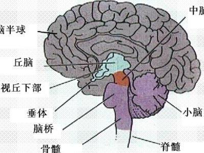
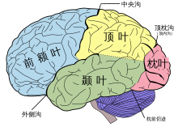
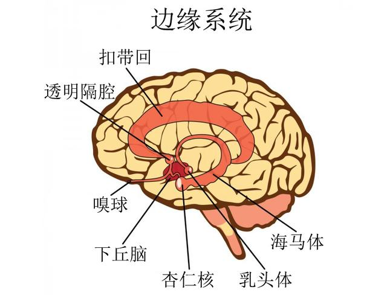

# 中枢神经系统(SNC)

**中枢神经系统(SNC)为神经系统的主要部分，由下列器官组成：**
1. 脑(Encefalo)，又由大脑(cerebro)、小脑(cerebelo)及脑干(tallo encefálico)组成。
2. 脑膜(Meniges)，又由硬脑膜(duramadre)、蛛网膜(piamadre)及软脑膜(aracnoides)组成。其主要作用是保护中枢神经系统。
3. 脊髓(medulo espinal)，在脊柱(proteccion ósea)中心，并被它保护着。

## SNC的主要结构及其作用：

### 大脑皮层(corteza cerebral)
其主要作用是**接受信息并生成响应**
并且根据空间位置，大脑皮层被分为几个脑叶：
- 额叶(lóbulos frontal)：高级认知功能，比如**学习、语言、决策、抽象思维、情绪**等。
- 顶叶(lóbulos parietal)：躯体感觉，空间信息处理，视觉信息和体感信息的整合。**(más genelizado，通用)**
- 颞叶(lóbulos temopral)：**听觉，嗅觉**。
- 枕叶(lóbulos occipital)：**视觉**。
- 边缘系统(Sistema límbico)：指包含海马体及杏仁体在内，支援多种功能例如**情绪、行为及长期记忆**的大脑结构。

### 小脑(cerebelo)
小脑在**感觉感知、协调性，和运动控制**中扮演重要角色。

### 中脑(mesencefalo)
传递**听觉信号**并控制**眼球运动**。

### 延髓(baldo raquídeo)
其具有心血管中枢及呼吸中枢等重要维生中枢的结构及感应器，能借此维持体内平衡。
**管控可自主运作的功能，如呼吸、心率等。**(funciona autonomas como respiracion, ritmos cardiaca, etc.)

### 脑桥(puente de Varolio)
**调节和控制睡眠、清醒节律和呼吸模式。**(sueno, vigilia ritmos y patron de la respiracion.)

## 以下结构都属于边缘系统

### 丘脑(Tálamo)
除了嗅觉之外，其余各种感觉讯息都经过丘脑，再传送到大脑皮层。因此，丘脑有时被称为脑的中枢。
Sistema Limbico (producción de emociones impulsos y conductas) basicas.

### 下丘脑(Hipotálamo)
调节内脏活动和内分泌活动的较高级神经中枢所在。
**控制释放的激素及自主神经系统(SNA)。**(Liberacion de hormonas y control de sistema nervioso autónomo(S.N.A.))

### 杏仁核(amigdalino)
**情绪反应的处理和储存。**
涉及指令刺激性的重要皮质刺激，例如关于报仇及恐惧。
Sensacion de plucer, castogo.

### 海马体(Hipocampo)
形成**长期记忆(memoria de largo plazo)** 的必要部分。

