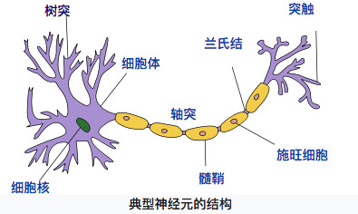

# 神经元(Neurona)

神经元是神经系统的结构与功能单位之一。神经元能感知环境的变化，再**将信息传递给其他的神经元(电化学信号）**

## 神经元的结构
 - **细胞核**(Nucleo)
 - **细胞体**(Cuerpo celular)
 - **树突**(Sinapsis)
 - **轴突**(Axon)
 - **髓鞘**(Capa mielinaciar)
 - **兰氏结**(Nodulos de Ranvier)
 - **突触**(Botones terminales \ bulbos sinápticos)
 - 施旺细胞(Célula de Schwann)

## 神经元的分类
不同功能、不同区域的神经元外型有所差异，依照突起的多寡分成**双极神经元**(Bipolar)、**单极神经元**(Unipolar)、**多极神经元**(Multipolar)、**锥体神经元**(Piramidal)。
