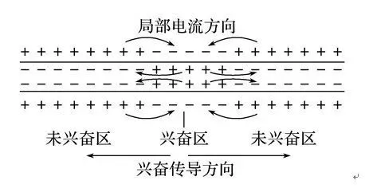
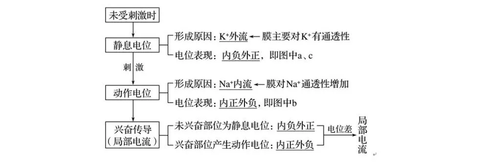
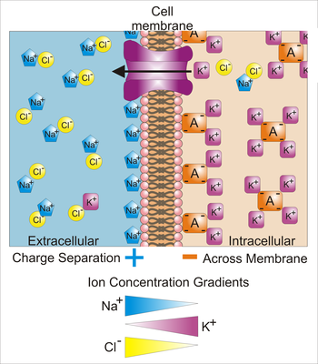
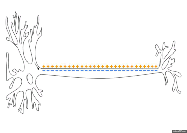
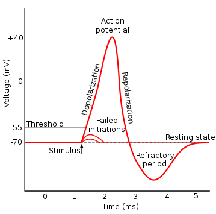

# 神经冲动(Impulso nervioso)

当我们受到外界刺激时，会产生神经兴奋。 神经兴奋是可以传导的，当它传导到肌肉时，会使肌肉也产生兴奋，肌肉兴奋又会引起肌肉收缩，**从而产生各种动作**。 我们将**这种能够传播的神经兴奋称为神经冲动**。 可以说，肌肉收缩就是神经冲动的间接体现。

## 神经兴奋的传递

**兴奋**：指动物体或人体内的某些组织(如神经组织)或细胞感受外界刺激后，由相对静止状态变为显著活跃状态的过程。

**传导形式**：电信号(或局部电流)，也称神经冲动。

**传导特点**：双向传导

#### 传导过程

---

## 膜电位(Potencial de menbrana)
膜电位是细胞内及细胞外之间的电压差。

## 静息电位
未进行传递时的细胞膜状态。

## 动作电位
进行传递时的细胞膜状态，并发生极化。
细胞膜上有多种离子通道。而动作电位的产生，则与钠和钾离子通道有关。这些离子通道的开关状态与膜电位有关，即是所谓的电压门控离子通道。

例如钠离子通道，在静止膜电位时它是关闭并且是可激活的。当去极化到一特定值时就会引起其构象的改变，成为“打开”状态。但是离子通道却不会持续停留在开放状态，它会在几毫秒内关闭。这是通过膜上一蛋白质的失活域的活动实现的，这个失活域会像塞子一样堵住离子通道。离子通道这种状态被称为“关闭并失活的”。

