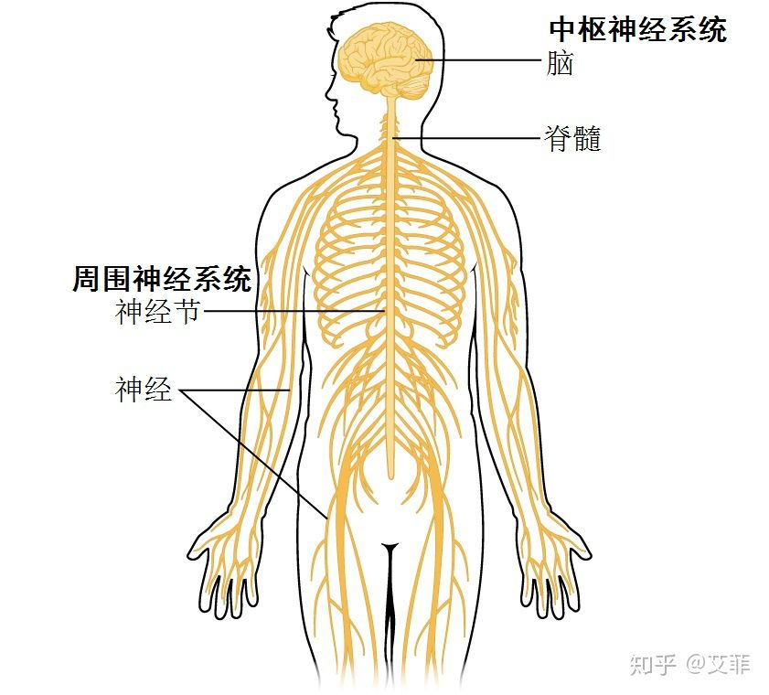

# 神经系统(sistema neuronal)

## 神经三大主要功能：
 - 感觉功能：身体的内在感觉受器探测如血压等内在刺激，外在感觉受器传送由皮肤等身体末端所接受到的外来刺激情报。这些情报经由**感觉神经传递至神经中枢**。
 - 综合及指令功能：对于感觉受器所送来的情报**进行分析、整理、判断，并做出适当的决定**。
 - 运动功能：将整理之后的情报，经由传出神经传递至末梢，并**执行决定**。

在1~3的功能当中，中枢神经(SNC)负责2的功能，周围神经(SNP)则负责1和3功能。在神经元的层面，1称之为感觉神经元、3称之为运动神经元。

## 神经系统的分类
神经系统被分为二部分：
 1. [中枢神经系统(Sistema Nervioso Centrar / SNC)](./中枢神经系统.md "中枢神经系统")
 2. [周围神经系统(Sistema Nervioso Periferico / SNP)](./周围神经系统.md "周围神经系统")

## 神经系统的组成(细胞层面上)
神经系统主要由两种细胞组成：
 1. [神经元](./神经元.md "神经元")
 2. [神经胶质](./神经胶质.md "神经胶质")

神经元是神经系统的主要细胞，而神经胶质是神经系统的次要细胞结构与营养。

## 神经信号的传递
 - [神经冲动](./神经冲动.md "神经冲动")(电)
 - [神经递质](./神经递质.md "神经递质")(化)