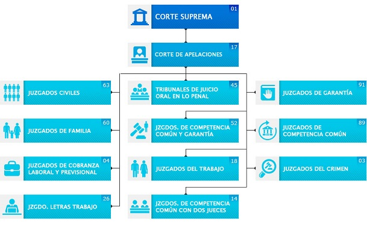

<h1 align=center>智利司法权：机构及运作 (El Poder Judicial Chileno: Instituciones y Funcionamiento)</h1>

## 关键词
- Poder Ejecutivo
- Poder Legislativo
- Poder Judicial
- Imparcialidad - 公正
- Equilibrio - 平衡
- Sanción - 制裁
- Corte Suprema - 最高法院
- Cortes de Apelaciones - 中级法院
- Juzgado de Policia Local - 基层法院
- Querella - 刑事诉讼
- Demanda - 举报、报案
- Denuncia - 起诉、民事诉讼
- Imputados/Demandados/Acusados - 被告
- Victima - 起诉者、受害者
- Testigo - 证人
- defensor - 辩护人
- abogado - 律师
- Ministerio Público
- Defensoría Penal Pública 
- Juez de Garantía
- El Juicio Oral
- Tribunal colegiado
- Recuerdo de Reparatorios

## 三权分立

- **行政权(Poder Ejecutivo)**
    - Gobierno
    - Administra y conduce el Estado.
- **立法权(Poder Legislativo)**
    - Congreso: Senadores y Diputados
    - Elabora las leyes
- **司法权(Poder Judicial)**
    - Tribunales de Justicia
    - Aplica las leyes y sanciona su incumplimiento.

三权分立的特点：

1. Poderes autonomos.
2. Interactuan y se controlan mutuamente.
3. Desconcentracion del poder.
4. Eficacia de la gestion del Estado.

## 何为正义

*“正义是持续不断且永恒的意愿，给予每个人他们应得的权利。” ("La Justicia es la constante y perpetua voluntad de dar a cada uno su derecho")*

“法律的规定是：‘诚实生活，不伤害任何人，给予每个人他们应得的。’”

"Los preceptos o mandatos del derecho son: 'Vivir honestamente, no hacer daño a nadie y dar a cada uno lo que le corresponde.'" 

## 正义之像 (Iconográfica de la justicia)

 

**公正：看事实，不看人。**
**Imparcialidad: no ve hombre, sino hechos.**

**平衡：根据证据进行判断。**
**Equilibrio: Juzga en virtud de las evidencias.**

**制裁：惩罚并修复损害**
**Sanción: castigo y reparación del daño**

## 智利司法体系的结构

智利的司法系统分为三个层次：

1. **最高法院(Corte Suprema)**：它是智利司法体系的最高层，负责监督其他法院、解释法律，以及审理重大案件。全国只有1座。

2. **中级法院(Cortes de Apelaciones)**：各个地区都有这样的法院，主要审理上诉和复核案件。全国共17座。

3. **基层法院(Juzgados de Letras o Juzgado de Policia Local)**：这些法院分为不同的部门，处理各种案件，包括民事、刑事和家庭案件等。全国共465座。

最高法院的法官由总统提名，经国会批准，他们是智利的最高裁判官。各级法院都受到最高法院的监督，以确保法律公平和正义的实施，保护国民的权益。

## 刑事控告，诉讼与举报 (Querella, Demanda y Denuncia)

### 刑事诉讼 (Querella)

刑事诉讼是一种程序性法律行为，包括向法院发出的意愿声明、请求启动程序或加入现有程序。简单来说，这是针对自然人采取的司法行动，**因为他或她被认为对某些犯罪行为负责。**

**刑事诉讼的目的是让该人因所犯罪行入狱**，并赔偿所造成的损失。

La querella es un acto Jurídica procesal que consiste en una declaracion de voluntad dirigida a un tibunal, por la que se solicita iniciar un procedimiento, o la adherir a uno ya existente. En termicos mas simples, se trate de una aacion judicial intentada en contra de una persona natural, **porque se le estima responsable de algun hecho delictual**.

**La querella tiene por objeto hacer que la persona cumpla en la carcel**, la infraccion penal que la cometido, y responda con los danos causados.

**记：送入监狱**

### 民事诉讼 (Demanda)

民事诉讼(起诉)是指当事人向法院提起的正式法律诉讼，通常是为了解决争议或索赔权益。

**记：要求索赔**

### 举报 (Denuncia)

举报(报案)是指民众或机构向警察或相关机构报告犯罪或违法行为的行为。

**记：举报犯罪行为**

## 2005年刑事诉讼改革 (Reforma Procesal Penal de 2005)

### 新机构 (Nuevos Actores Institucionales)

#### Ministerio Público (公诉机关)

这是一个自主机构，具有层次性质，是智利国家机构的一部分。

其职能包括：
- 主导犯罪调查。 
  Dirigir de forma exclusiva la investigacion de delitos.
- 开展公共刑事诉讼。 
  Ejecer la accion penal pública.
- 保护受害人和证人。 
  Proteger a los victimas y testigo.
- 在合适的情况下将被告送上法庭。 
  Llevar a los imputados a los tribunales, si corresponde.

**记：负责刑事诉讼和刑事调查。分离了案件调查和审判的职能。**

#### Defensoría Penal Pública (公共刑事辩护机构)

公设辩护人(Defensores Públicos)是口头审判中为受到刑事起诉的人提供辩护的律师（对于没有律师的人）。
    
**记：负责为那些无法支付私人辩护律师费用的人提供法律辩护的机构。**

#### Juzgado de Garantía (担保法院)

其使命是保护被告以及诉讼过程中其他参与者（例如证人、受害者或被告）的权利。

它们的职责包括：
- 主持口头审判准备听证会。 
  Dirigen los audiencias de preparación del juicio oral.
- 决定对于检察官和辩护律师提交的调查程序授权和其他请求。 
  Resuelven las autorizaciones de los diligencias de investigacion y demas peticiones que le presente el fiscal y el denfensor.
    
**记：其主要职责是监督和确保刑事程序在法律和公正的情况下进行，保护起诉过程中参与者(证人、受害者或被告)的权利，确保遵守程序性保障。**

#### Tribunal Oral en lo Penal (审讯法庭)

由合议庭（由三名法官组成）的法官，在**口头审判期间听取并进行辩论，然后确定被告有罪或无罪**。他们的职责是判断他们面前出现的冲突。

##### 公开审讯 (El Juicio Oral)

它由以下部分组成：

- 由三名法官组成的合议庭，他们在整个听证会期间都出席，听证会以口头方式进行，公开进行，所有相关方都在场。 
  Tribunal colegiado compuesto por tres jueces presentan en toda la audiencia, que se desarrollo oralmente, en forma publica y con presencia de todas las partes.
- 判决在同一听证会中宣布。 
  La sentencia se dicta en la misma audiencia.
- 参与听证会的有公诉机关、被告、受害人和辩护律师。 
  En la audiencia participa el ministerio publico, el acusado, la victima y el defensor.
- 在口头审判的听证会期间，由提出的一方进行询问的证人和专家，同时由对方进行反问（矛盾原则）。 
  Durante la audiencia del juicio oral, los testigos y peritos son interrogados por la parte que los preenta y contrainterrogados por la contrario (principio de contradiccion).

**记：公开法庭，公开审讯**

### 赔偿协议 (Recuerdo de Reparatorios)

#### 何时适用

当在担保法官(Juez de Garantía)的批准下，起诉和被告达成一种补偿所造成损害的协议，以解决冲突。

为了获得批准，其所涉及的罪行必须：
- 所犯罪行不是故意的。 
  Que el hecho cometido no haya sido intencional. 
- 所涉及的伤害没有导致受害人生病或无法工作超过30天。 
  Que se trate de lesiones que no hayan causado a la victima enfermedad o incapacidad para trabajar por mas de 30 dias. 
- 犯罪行为与物质财产有关。 
  Que el delito tenga relacion con bienes materales.

#### 何时不适用

当被告已经多次犯了**同一项被指控的罪行**。

#### 结果

- 受害人获得了令人满意的赔偿，而被告不再承担责任。 
  La victima revibe una reparacion satisfactoria y el imputado queda libre de responsabilidad.

- 在这里，国家放弃继续进行程序，而是将关注点放在满足受害人和被告的利益上。 
  Aqui el estado renuncia seguir adelante con el peocedimiento, pero esta vez pone sus ojos en la satisfaccion de interes de la victima mas el del imputado.

- 在这方面，一些更适用于所谓的恢复性正义的元素被提出。 
  En este aspecto se rescatan algunos elementos mas propios de lo que se conoce como Justicia Restaurativa.

#### 益处

- 更快的法律程序。 
  Mayor rapidez del proceso.
- 公正性。 
  Imparcialidad
- 保护受害人和被告。 
  Proteccion a victimas e Imputados
- 透明度和公开性。 
  Transparencia y Publicidad

## 智利司法系统：昔与今的比较

<table style="text-align:center" align="center" table-layout="fixed" border="1" cellpadding="2" cellspacing="0" width="60%">
    <tr>
        <th style="width:50%" colspan="3">过去</th>
        <th style="width:50%" colspan="3">现在</th>
    </tr>
    <tr>
        <td style="width:50%" colspan="3"><b>法官</b> 调查、指控和裁决</td>
        <td style="width:25%" colspan="2"><b>法官</b> 裁决</td>
        <td style="width:25%" colspan="2"><b>检察官</b> 调查、起诉</td>
    </tr>
    <tr>
        <td colspan="3">法官以秘密总结的形式指导调查，整个过程的所有职能都由他承担。</td>
        <td style="width:16.7%"><b>担保法官</b> 确保正当程序并不侵犯个人权利。</td>
        <td style="width:16.7%"><b>公共辩护人</b> 代表被告</td>
        <td style="width:16.7%"><b>检察官</b> 调查，对被告提出指控并指导警方的行动</td>
    </tr>
     <tr>
        <td style="width:50%" colspan="3"><b>程序</b> 秘密且以书面形式</td>
        <td style="width:50%" colspan="3"><b>程序</b> 公开、及时并通过<b>公开诉讼</b></td>
    </tr>
    <tr>
        <td style="width:50%" colspan="3"><b>过程</b> 由法官命令的预防性措施</td>
        <td style="width:50%" colspan="3"><b>过程</b> 各种保全措施：拘留（如果存在“对社会构成危险”），居家监禁，有监视的自由和限制出境</td>
    </tr>
    <tr>
        <td style="width:50%" colspan="3">一名单一的个体负责调查和裁决（法官），这种情况不允许足够的距离以确保更为客观的判决。</td>
        <td style="width:50%" colspan="3">公共部门的检察官负责进行调查并指导警方，而由三名成员组成的法庭则负责裁决。</td>
    </tr>
    <tr>
        <td style="width:50%" colspan="3">被拘留者直接被调查警察送往监狱，没有辩护的机会。</td>
        <td style="width:50%" colspan="3">警方必须将被拘留者带到担保法官面前，只有担保法官有权决定是否允许入狱。</td>
    </tr>
    <tr>
        <td style="width:50%" colspan="3">被拘留者在未经起诉或未出庭见法官的情况下可以在监狱内停留多达5天。</td>
        <td style="width:50%" colspan="3">警方必须在24小时内将被拘留者送交给担保法官。</td>
    </tr>
</table>

 
 
