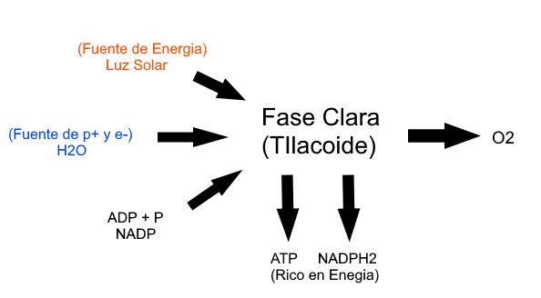
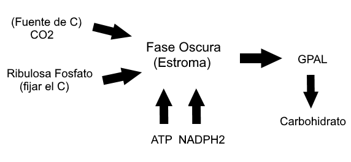

<h1 align=center>Actividad Celular</h1>

## Fotosintesis

Proceso anabolico que realiza organismos que poseen clorofila

Es la sintesisi de moleculas organicas a partir de compuestos inorganicos simples como $CO_2$ y $H_2O$ ulitizando la energia radiante de la luz.

$$ CO_2 + H_2O \rightarrow_{Luz Solar, Cloroplasto} C_6H_{12}O_6+ 6O_2 $$

Poseen 2 Etapas:

### Fase Clara o Reaccion de Hill

Ocurren en las granas del cloroplasto(Memb. **Filacoidales**), utiliza luz.

Su objetivo es **almacenar la energia solar como energia quimica de enlace** en los P-P del **ATP** y en los Hidrogenos que tansporta por la coenzima NADPH2 liberando O2 como producto.

NADPH, NADPH2: Coenzima que tansporta Hidrogeno(p+ y e-), rico en energia.



### Fase Oscura o Ciclo de Calvin

Ocure en el **Estroma** del cloroplasto.

No utiliza luz, pero ocurre de dia.

Su objetivo es **formar moluculas organicas** ricas en energia, la que se obtiene del ATP y NADPH2.



Las moleculas organicas llevan la energia en sus enlaces y en los H que poseen.

Clorofila a: azul y rojo
Clorofila b: violeta, azul y naranja
Cototenoide: violeta, azul, verde.

Factores que afecta Fotosintesis:
- Intensisdad luminosa
- Consentracion de CO2
- Temperatura
- Cantidad de Agua

## Respiracion Celular

Proceso catabolico que realiza los seres vivos para degradar nutrientes y obtener energia de ellos.

Hay 2 tipos:
- Aerobica
- Anaerobica

### Respiracion Celular Aerobica

$$ C_6H_{12}O_6 + 6O_2 + 6H_2O \rightarrow Energia(ATP y Calor) + 12H_2O + 6CO_2 $$

Posee 4 etapas:

#### Glucolisis(En citoplasma)

- Es anaerobica.

```
1 glucosa(6C)
  |- 2 ATP
  |- 2 NADPH2
  2 Piruvato(3C)
```

#### Formacion de Acetil CoA

- En la matriz mitocondrial para formar un molecula que entra al ciclo de krebs
- Es Aerobica

$$ 2 Piruvato(3C) \ \  _{2CoA} \rightarrow \ _{2NADH2} \ \  2Acetil\ CoA(2C) + CO_2 $$

#### Ciclo de Kreb

- En la matriz mitocondrial
- Es aerobica

Para obtener la Max. cantidad de H2 posibles para coenzima NAD y FAD.

#### Cadena Transportadora de Electrones y Fostorilacion Oxidativa

Las coenzimas obtenidas NADH2 y FADH2, van a entregar sus H2 a una cadena transportadora de e-, con lo que se libera energia y se forma ATP.

$ 1 NADH2 = 3ATP + H_2O $
$ 1 FADH2 = 2ATP + H_2O $

El aceptor final de H+ y e-, es el O2

1 molecula de glucosa permite formar 38 ATP en procariotas y 36 ATP en eucarionte, debidos a que los NADH obtenidos en la glucolisis gastan 2 ATP en ingresar a la midocondria.

---

<table id="table" style="text-align: center;" align="center" border="1px" width="50%">
    <tr>
        <td><b>\</b></td>
        <td><b>ATP</b></td>
        <td><b>NADPH2</b></td>
        <td><b>FADH2</b></td>
        <td><b>CO2</b></td>
        <td><b>H2O</b></td>
    </tr>
    <tr>
        <td><b>Glucolisis</b></td>
        <td>2</td>
        <td>2</td>
        <td>-</td>
        <td>-</td>
        <td>-</td>
    </tr>
    <tr>
        <td><b>Formacion de Acetil CoA</b></td>
        <td>-</td>
        <td>2</td>
        <td>-</td>
        <td>2</td>
        <td>-</td>
    </tr>
    <tr>
        <td><b>Ciclo de Krebs</b></td>
        <td>2</td>
        <td>6</td>
        <td>2</td>
        <td>4</td>
        <td>-</td>
    </tr>
    <tr>
        <td><b>Subtotal</b></td>
        <td><b>4</b></td>
        <td><b>10</b></td>
        <td><b>2</b></td>
        <td><b>6</b></td>
        <td><b>-</b></td>
    </tr>
    <tr>
        <td><b>Cadena de Respiracion<br />(NADPH2)</b></td>
        <td>30</td>
        <td>-</td>
        <td>-</td>
        <td>-</td>
        <td>10</td>
    </tr>
    <tr>
        <td><b>Cadena de Respiracion<br />(FADH2)</b></td>
        <td>4</td>
        <td>-</td>
        <td>-</td>
        <td>-</td>
        <td>2</td>
    </tr>
    <tr>
        <td><b>Total</b></td>
        <td>38(Pro)<br />36(Eu)</td>
        <td>-</td>
        <td>-</td>
        <td>6</td>
        <td>12</td>
    </tr>
</table>

### Respiracion Celular Anaerobica

Proceso catabolico que realizan los seres vivos, cuando no disponen de O2 o no tienen mitocondria(Mesosomas).

El nombre de fermentacion mas importantes son:
- Fermentacion Lactica
- Fermentacion Alcoholica

**Lactica**

el rendimiento energetico es de solo 2 ATP y el aceptor final de H+ y e- es el piruvato Acetaldehido(F. Alcoholica)